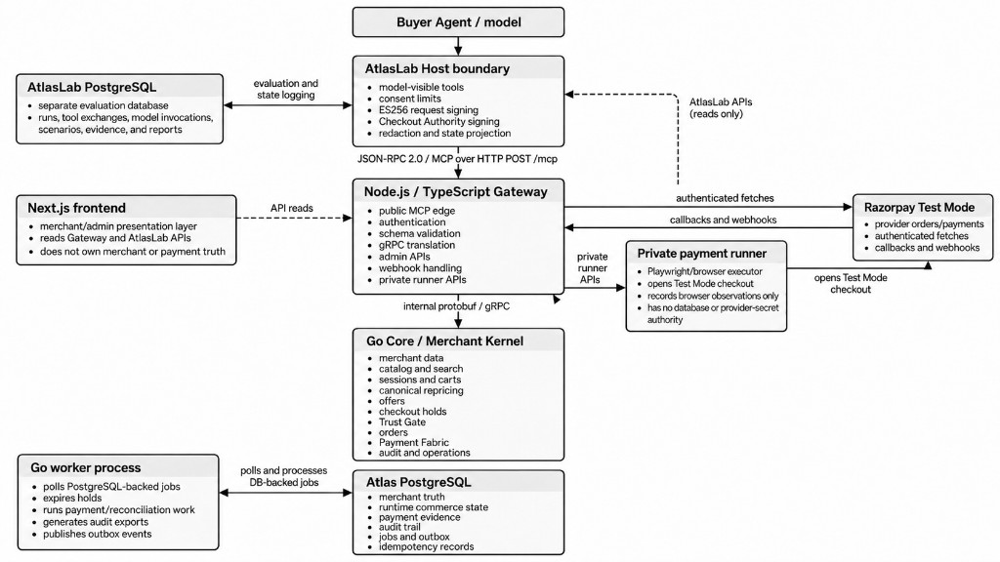
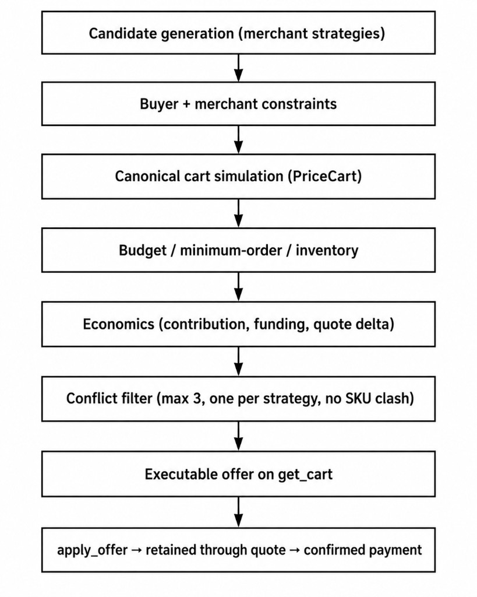

# Atlas

## Agentic commerce without surrendering merchant control

> **AI buyer → MCP commerce interface → merchant-authoritative Core → bounded checkout authority → Razorpay → provider reconciliation → confirmed order**

Atlas is a merchant-controlled agentic commerce system. An AI buyer can discover products, build a cart, evaluate merchant-approved offers, and initiate checkout — without the language model becoming the source of truth for pricing, inventory, discounts, payments, or orders.

A second, equal problem: an agent that faithfully buys “one banana under ₹200” will leave fee-threshold and basket-expansion revenue on the table. Atlas’s **Commercial Engine** is merchandising for that buyer. It proposes bounded, simulated cart patches designed to increase **incremental confirmed merchandise** while remaining inside the buyer’s budget, the merchant’s contribution rules, and a CONTROL vs TREATMENT measurement.

The reference merchant is **QuickMart**. Payment execution and reconciliation use **Razorpay Test Mode**. Checkout is operator-assisted. Settlement is not implemented.

The design principle:

> **The agent proposes. The merchant decides. The payment provider proves.**

Models are useful for reasoning and intent. Commerce still needs deterministic authority over financial and transactional state. A browser success screen, or an LLM saying “payment succeeded,” is not evidence.

**Atlas demonstrates controlled Test Mode commercial evidence and payment reconciliation. It does not claim real-world causal revenue uplift.**

For a more detailed explanation of the project, see the [Atlas Notion page](https://app.notion.com/p/Atlas-3d201698b6f0808ca8dcc6accf757ca1?source=copy_link).

---


## Why Atlas?

AI agents can search catalogs, compare products, call tools, and walk a checkout flow. Letting an agent **transact** is a harder systems problem.

A merchant still needs to know:

- Is the product available at the buyer’s location?
- Is the price current and merchant-authoritative?
- Is the discount real?
- Did the agent respect the buyer’s budget?
- Is inventory still available at checkout?
- Was this exact payment authorized?
- Did the payment provider actually capture the payment?
- What happens if checkout times out after payment was submitted?
- Can the agent retry and create a duplicate charge?
- What evidence supports the order and any claimed commercial outcome?
- If the buyer is an agent with a tight mission and budget, how does the merchant still grow a profitable basket without the model inventing discounts?

Atlas therefore separates:

```text
AI reasoning
    ↓
Structured commerce actions (MCP)
    ↓
Merchant-authoritative validation
    ↓
Bounded checkout authorization
    ↓
External payment execution
    ↓
Provider-backed reconciliation
    ↓
Confirmed merchant order
```

The model can decide **what it wants to attempt**. Atlas decides **whether that action is valid**. Razorpay evidence determines **whether the financial effect actually occurred**.

---


## What Atlas does

An AI buyer can:

- Discover merchant capabilities
- Create a location-aware shopping session
- Express a shopping mission and budget
- Search merchant-authoritative inventory
- Inspect products, build and modify a cart
- Receive and apply merchant-controlled offers (executable cart patches, not LLM-authored discounts)
- Prepare a versioned checkout proposal
- Request payment and retrieve the resulting order

The merchant, through Core, can surface bounded strategies that try to raise confirmed merchandise and contribution — fee-threshold fills, grounded add-ons, brand-funded promotions — without handing pricing or discount authority to the model.

The agent does **not** control product truth, sellable inventory, prices, promotion eligibility, discount amounts, cart totals, checkout amounts, payment status, or order confirmation. Those stay inside deterministic merchant infrastructure.

---


## Architecture




| Domain | What it owns |
| --- | --- |
| Host | Buyer-agent identity, consent, signed mutation proofs |
| Gateway | Public MCP HTTP, webhooks, admin BFF |
| Core | Catalog, cart, offers, holds, orders, payment fabric |
| Worker | Hold expiry, reconciliation jobs, outbox |
| Payment runner | Private Test Mode checkout executor — observation, not payment truth |
| Razorpay Test Mode | Simulated capture |
| AtlasLab | Contract, compatibility, and commercial eval |
| Console | Merchant evidence at `/` — reads APIs; does not own merchant or payment truth |


Invariant: **model intelligence does not imply transaction authority.** An agent can request an operation. It cannot manufacture the merchant state required for that operation to succeed.

---


## Public MCP contract

Atlas exposes a 13-tool public contract, `atlas.merchant.v1`. JSON schemas live in `schemas/mcp/`.


| Group                 | Tools                                                                                           |
| --------------------- | ----------------------------------------------------------------------------------------------- |
| Discovery and session | `get_capabilities`, `create_session`, `set_intent`, `search_catalog`, `get_product`, `get_cart` |
| Cart and offers       | `add_cart_item`, `update_cart_item`, `remove_cart_item`, `apply_offer`                          |
| Checkout and orders   | `prepare_checkout`, `complete_checkout`, `get_order`                                            |


`get_session`, profile, and substitution tools are not on public MCP. Internal workers, inventory mutation, reconciliation, and payment-state changes are not buyer tools.

A typical transaction:

```text
get_capabilities → create_session → set_intent → search_catalog
    → cart mutations → apply_offer → prepare_checkout
    → bounded Checkout Authority → complete_checkout
    → Razorpay Test Mode → provider reconciliation
    → CAPTURED_RECONCILED → CONFIRMED order
```

---


## Pricing

One canonical repricer (`PriceCart`) is used for cart display, offer simulation, offer application, and checkout:

```text
Merchandise     = Σ(unit price × quantity)
Net merchandise = merchandise − valid discounts
All-in total    = net merchandise + delivery + handling + small-order fee + tax
```

Search, cart, offers, checkout, and payment must not develop different definitions of what the buyer owes. The model may reason about price. It does not calculate the authoritative amount.

---


## Commercial Engine

Human storefronts merchandize with homepages, carousels, and checkout nudges. An MCP agent does not browse that way. It receives a mission (“buy breakfast under ₹180”, “one Robusta banana under ₹200”), calls tools, and stops when the mission looks done. Left alone, that produces a **minimum satisfying cart**: the SKU that matches the prompt, often below QuickMart’s small-order or free-delivery threshold, with no complementary lines.

That is the agentic revenue problem. The buyer agent is optimizing for the **buyer’s stated intent**. The merchant still needs **incremental confirmed revenue** — more merchandise through checkout, without destroying contribution or violating the budget the agent is bound to respect.

Atlas’s answer is a deterministic Commercial Engine whose economic objective is `incremental_confirmed_revenue_v1`. The model never authors a discount, a price, or a fee waiver. Core generates a candidate, simulates it on the same `PriceCart` path as checkout, and only then shows the agent an **executable offer**: a cart patch, expiry, buyer impact, funding split, and grounded explanation. `apply_offer` revalidates against the current session, cart version, inventory, budget, and campaign state. If the cart moved, the offer dies.



Offers that fail simulation never reach the agent. Drops include `OVER_BUDGET`, `BELOW_MINIMUM_ORDER`, `NEGATIVE_CONTRIBUTION`, `ECONOMICS_INCOMPLETE`, `CONSTRAINT`, `CONTROL_ARM`, and slot/conflict caps. Ranking (`rank_conservative_v1`) prefers **merchant revenue delta** and contribution, and penalizes large buyer-spend overshoot. A fill that clears a fee by adding a historically useful SKU outranks a random gap-filler.

### How strategies try to grow merchant revenue


| Lever                | Strategies                                                                    | What they do in an agent checkout                                                                                                                                                                                                                                                                                                                   |
| -------------------- | ----------------------------------------------------------------------------- | --------------------------------------------------------------------------------------------------------------------------------------------------------------------------------------------------------------------------------------------------------------------------------------------------------------------------------------------------- |
| Threshold completion | `SMALL_ORDER`, `FREE_DELIVERY`                                                | If the cart is just under a fee threshold, propose a sellable add-on that clears it. The buyer can save the fee; the merchant books more merchandise. Sitting eval: banana-only CONTROL pays the small-order fee; `SMALL_ORDER` TREATMENT adds a fill SKU, fee goes to zero, merchant-net merchandise rises, all-in stays under the mission budget. |
| Basket expansion     | `REORDER`, `REPLENISHMENT`, `ROUTINE`, `CART_COMPLETION`, `BASKET_REC`, `FBT` | Grounded add-ons from fixture purchase history, repurchase gaps, routine baskets, and catalog pairing — not LLM improvisation.                                                                                                                                                                                                                      |
| Mix and margin       | `LARGER_PACK`, `BRAND_PROMO`                                                  | Larger pack when unit price is better; brand-funded campaigns so a discount need not be fully merchant-funded.                                                                                                                                                                                                                                      |
| Discovery            | `PAST_PURCHASE`, `SEARCH_RANKING`                                             | Bias search toward what this buyer has bought, still from catalog truth.                                                                                                                                                                                                                                                                            |


Live demo strategies are `FREE_DELIVERY`, `SMALL_ORDER`, `BRAND_PROMO`, and `FBT`. The others exist on the engine; they are not the sitting commercial treatment.

Fee-fill scoring is not “add the cheapest SKU.” `FillScore` weights buyer usefulness (history / personal basket) above a smaller economics term (fee saving vs item cost, how tightly the SKU fits the gap). The engine would rather miss a fill than push an item the buyer has no reason to accept — an agent that is told not to invent discounts will also refuse a nonsense add-on.

### CONTROL versus TREATMENT

Permission to shop is not permission to merchandize. The Host stamps `evaluation_arm`. **CONTROL** returns no commercial candidates (`CONTROL_ARM`). **TREATMENT** allowlists merchant-approved strategies. The agent cannot set the arm or the allowlist.

That split is how Atlas asks a revenue question at all: same mission, same fixture, same budget, paired journeys, merchant-net compared only on **confirmed, provider-reconciled** orders. Commercial offer success means the offer was applied, retained through quote validation, and paid — not merely shown.

AtlasLab’s sitting commercial cell is bounded `SMALL_ORDER` on the frozen `fee_threshold` mission. Merchant-net delta may be positive, neutral, or unproven. Atlas does not manufacture uplift. Test Mode paired evidence is not real-world causal revenue.

---


## Checkout

`prepare_checkout` revalidates prices, cart, inventory, fees, and discounts, then creates a proposal, quote hash, inventory hold, and expiration. `complete_checkout` requires additional **Checkout Authority** bound to that exact proposal, amount, currency, session, cart, host, and a single-use nonce.

> Permission to shop is not unlimited permission to spend.

---


## Payment truth

> **The browser is not payment truth. Razorpay evidence is.**

The private payment runner may open Razorpay Checkout and observe browser state. That path is operator-assisted. A success screen is **not** capture. Atlas does not claim autonomous payment.


| State                    | Meaning                                 |
| ------------------------ | --------------------------------------- |
| `CREATED`                | Atlas created the payment attempt       |
| `PROVIDER_ORDER_CREATED` | Razorpay order exists                   |
| `RUNNER_QUEUED`          | Executor is queued                      |
| `CHECKOUT_IN_PROGRESS`   | Checkout interaction is occurring       |
| `PROVIDER_SUBMITTED`     | Submission was observed                 |
| `RECONCILING`            | Atlas is verifying provider evidence    |
| `OUTCOME_UNKNOWN`        | External result is ambiguous            |
| `CAPTURED_RECONCILED`    | Capture authenticated and matched       |
| `FAILED_VERIFIED`        | Provider evidence confirms failure      |
| `CANCELLED_VERIFIED`     | Provider evidence confirms cancellation |


`OUTCOME_UNKNOWN` is a safety state, not a failure. If Atlas submits payment and then loses the response, treating that as `FAILED` would invite a retry that might double-charge. While unresolved, Atlas freezes duplicate payment retries, fulfilment, additional money effects, automatic order confirmation, and unsafe hold release.

Capture is confirmed from authenticated, matched provider evidence (webhook HMAC, event dedup, provider order and payment lookup, amount and currency match). Only then:

```text
Payment → CAPTURED_RECONCILED
Order   → CONFIRMED
```

```text
Agent says success            ✗
Browser says success          ✗
Runner says success           ✗
Authenticated provider match  ✓
```

Settlement is not implemented. Do not claim merchant settlement.

---


## AtlasLab and evidence

AtlasLab asks more than “did the model eventually call `complete_checkout`?” It evaluates the trajectory: task success, budget and policy adherence, tool selection, offer handling, duplicate-checkout avoidance, and payment-uncertainty behavior.

### Track 1: agent transactability

The Track 1 surface is the buyer-to-merchant transaction path: a model uses the narrow Public MCP contract, while Atlas retains authority over catalog, inventory, pricing, offers, checkout authorization, payment state, and order confirmation. The deterministic suite proves the contract and safety boundaries; the live compatibility suite measures controlled model behavior; and the commercial suite reports only Test Mode paired evidence that survives the guardrails described below.

That broader question is **agent sellability**: how reliably an AI agent can complete a merchant transaction while respecting buyer constraints, merchant policy, and transaction safety.

Commercial eval then asks a merchant question on top: for the same mission, did TREATMENT (engine on) change **merchant-net on confirmed, provider-reconciled orders** versus CONTROL (engine off)? The primary reported metric is merchant-net revenue per eligible buyer journey, not offer impressions.


| Endpoint                                | What it can support                                                                 |
| --------------------------------------- | ----------------------------------------------------------------------------------- |
| `POST /lab/v1/deterministic-eval`       | Contract evidence only                                                              |
| `POST /lab/v1/agent-compatibility-eval` | Controlled agent behavior, not revenue                                              |
| `POST /lab/v1/commercial-uplift-eval`   | Test Mode paired CONTROL vs TREATMENT on merchant-net; not real-world causal uplift |


Missing evidence is never presented as zero. `OUTCOME_UNKNOWN` is not a failed payment. Browser completion is not captured payment. Synthetic fixture history is not real demand. Test Mode revenue is not production uplift.

Evidence states include confirmed, measured, partial, unavailable, ineligible, unresolved, simulated, and Test Mode only.

---


## QuickMart

One reference merchant, so the system can go deep on transaction safety instead of generic onboarding.

The `fix_quickmart_v1` fixture includes 3 Bengaluru dark stores, 250 products, 350 SKUs, 720 location×SKU offers, 21 promotions, 20 bundles, and 12 Commercial Engine strategies. Sessions are location-aware. Sellable quantity is assortment- and stock-aware: a product existing in the catalog is not the same as it being assorted, in stock, and currently sellable at the buyer’s store.

Synthetic buyer history exercises commercial logic. It is not evidence of real customer demand.

---


## Failure modes Atlas designs around


| Failure                                    | Atlas boundary                                |
| ------------------------------------------ | --------------------------------------------- |
| Agent recommends unavailable inventory     | Merchant-authoritative catalog and inventory  |
| Agent hallucinates price                   | Canonical repricing                           |
| Agent invents a discount                   | Deterministic Commercial Engine               |
| Agent acts on a stale cart                 | Cart and session versioning                   |
| Agent receives unlimited payment authority | Transaction-specific Checkout Authority       |
| Signed action is replayed                  | Nonces, expiry, idempotency                   |
| Browser success becomes order success      | Provider reconciliation                       |
| Timeout triggers a duplicate payment       | `OUTCOME_UNKNOWN` and effect freeze           |
| Prompt injection tries to move money       | Deterministic validation and scoped authority |
| Missing evidence appears as revenue        | Explicit evidence eligibility                 |


---


## Six principles

1. **Merchant authority** — prices, inventory, promotions, and transaction state stay merchant-controlled.
2. **Agent-native interface** — a narrow, machine-readable MCP commerce contract.
3. **Deterministic commerce** — pricing and commercial decisions are reproducible and executable. The engine is designed to raise incremental confirmed merchandise in agent checkouts; it does not let the model invent the offer.
4. **Bounded transaction authority** — permission to shop is not unrestricted permission to spend.
5. **Provider-backed payment truth** — capture comes from Razorpay evidence, not the browser.
6. **Evidence-aware evaluation** — agent and commercial claims are tied to provenance and evidence quality.

---


## Current scope

**Atlas currently demonstrates** a public MCP commerce interface; one deeply modeled reference merchant; location-aware catalog and inventory; canonical pricing; a Commercial Engine designed for incremental confirmed merchandise in agent checkouts (executable offers, CONTROL vs TREATMENT, merchant-net reporting); versioned checkout and inventory holds; signed Host Proof and transaction-specific Checkout Authority; Razorpay Test Mode integration with provider-backed reconciliation; explicit unknown payment outcomes; and evidence-aware model evaluation.

**Atlas does not currently claim** arbitrary merchant onboarding; marketplace multi-tenancy; production payment certification; merchant settlement; real-world causal revenue uplift; universal commercial optimization; universal prompt-injection immunity; fully autonomous production payments; or real customer demand from synthetic fixture data.

> Architecture defines what Atlas is designed to enforce. Evidence determines what Atlas can actually claim.

---


## Repository

```text
apps/
├── gateway/          # Public MCP HTTP, webhooks, admin BFF
├── atlaslab/         # Agent evaluation and commercial experiments
├── payment-runner/   # Private Test Mode checkout executor
└── frontend/         # Merchant console

services/core/        # Merchant-authoritative Go Core
proto/atlas/merchant/v1/
schemas/mcp/          # Public tool JSON schemas
db/atlas/fixtures/quickmart-v1/
evidence/             # Sanitized commercial-proof schema
```

Useful entry points: `services/core/internal/cart/pricing.go`, `services/core/internal/commerce/engine.go`, `services/core/internal/commerce/simulate.go`, `services/core/internal/commerce/strat_fee_fill.go`, `services/core/internal/trust/proof.go`, `services/core/internal/app/gate.go`, `services/core/internal/app/checkout.go`, `services/core/internal/payment/webhook.go`, `services/core/internal/payment/reconcile.go`, `apps/atlaslab/src/host/boundary.ts`, `apps/atlaslab/src/model-eval/rpas.ts`, `db/atlas/fixtures/quickmart-v1/README.md`.

---


## Quick start

Requires Docker, Node.js 22+, and Go 1.25. Copy `.env.example` to `.env`. Never commit secrets. Live Mode Razorpay keys (`rzp_live_...`) must be rejected at process start.

Minimum keys for a local stack:

- `RAZORPAY_KEY_ID` / `RAZORPAY_KEY_SECRET` (Test Mode only)
- `RAZORPAY_WEBHOOK_SECRET`
- `ATLAS_ADMIN_SERVICE_TOKEN`, `ATLASLAB_API_TOKEN`

```bash
docker compose up --build
./scripts/demo.sh
```

Then open [http://127.0.0.1:3000](http://127.0.0.1:3000). The console is a single unauthenticated page: merchant details, commerce strategies, and the AtlasLab evaluation framework.

Point Razorpay Test Mode webhooks at `POST {ATLAS_PUBLIC_ORIGIN}/providers/razorpay/webhooks`. Core verifies the signature. Duplicate events are ignored. Capture is not confirmed from the webhook body alone.

The payment runner (`apps/payment-runner`) is a private executor. Set `ATLAS_RUNNER_EXECUTOR_CREDENTIAL`. It reports observations; Core still requires provider evidence.

Reset the QuickMart fixture:

```bash
curl -X POST http://127.0.0.1:8080/test/v1/fixtures/reset \
  -H "authorization: Bearer $ATLAS_TEST_FIXTURE_BEARER" \
  -H "content-type: application/json" \
  -d '{"fixture_snapshot_id":"fix_quickmart_v1"}'
```

Provider-backed commercial pair (operator-assisted; checkout.js success is not payment truth):

```bash
ATLASLAB_PROVIDER_ASSISTED_PAYMENTS=1 MODEL_ID=<approved-model> \
  node scripts/provider-commercial-proof.mjs
```

### Payment flow, fixture reset, and dashboard routes

The Payment flow is: buyer proposal → merchant-authoritative repricing → signed Host proof → bounded Checkout Authority → Razorpay Test Mode attempt → authenticated Webhook and provider fetch reconciliation → `CAPTURED_RECONCILED` → confirmed order. The Webhook is evidence input, not capture by itself; the private Runner only observes and reports checkout state. Use the Fixture reset endpoint above before a reproducible evaluation, and open the Dashboard routes at `/` for the merchant console; legacy console routes redirect there.

---


## Verification

```bash
make test
make release-verify
```

`make release-verify` is strict: clean worktree, ready Gateway, AtlasLab live-eval readiness, MCP protected-tool authentication ordering, ready frontend, and a fresh `artifacts/provider-commercial-proof.json` generated at the current `HEAD` after the last fixture-reset suite. That artifact is gitignored; regenerate it as above. See `evidence/README.md`.

Narrower gates: `make release-verify-static`, `make release-verify-runtime`, `make release-verify-commercial`. Static-only CI may set `ATLAS_RELEASE_STATIC_ONLY=1`. That is not runtime or commercial evidence.

---


## Known limitations

- One reference merchant; not arbitrary onboarding.
- External agents beyond the AtlasLab Host are not broadly certified.
